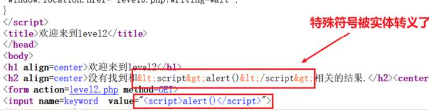

---

title:  xss_haozi_lab靶场心得

date: 2023-03-28 16:04:14

tags: CTF

categories: 靶场

---

## XSS原理和分类

XSS(Cross Site Scripting)，即跨站脚本攻击。攻击者向Web页面里插入恶意Script代码以攻击浏览Web页面的用户。XSS是针对用户层面的攻击。

反射型XSS：非持久化，需要欺骗用户点击链接才能触发XSS代码，反射型XSS大多是用来盗取用户的Cookie信息，一般出现在搜索页面。

反射型XSS攻击流程

①攻击者向用户发送带有XSS恶意脚本的链接

②用户点击了恶意链接，访问了目标服务器

③网站将XSS同正常页面返回到用户浏览器

④用户浏览器解析网页XSS恶意代码，向恶意服务器发起请求

⑤黑客从自己搭建的恶意服务器获取用户提交的信息

存储型XSS：持久化，恶意代码存储在服务器中。在评论区等地方插入代码，如果没有过滤或过滤不严，这些代码将存储在服务器中，用户访问页面的时候会触发代码并执行。容易造成蠕虫、盗窃cookie。

存储型XSS攻击流程

①黑客在目标服务器上传XSS恶意脚本到数据库

②用户在网站登录状态下访问目标服务器，查看存在恶意脚本的页面

③网站将xss同正常页面返回到用户浏览器

④用户浏览器解析了网页中的XSS恶意代码，向恶意服务器发送请求

⑤黑客从自己搭建的恶意服务器获取用户提交的信息

DOM型XSS攻击：基于文本对象模型（Document Object Model）的一种漏洞，网站前端JavaScript把不可信数据当作代码执行。DOM-XSS也是通过url传入参数去控制触发的，其实也属于反射型XSS。

DOM含义：当服务器中的页面到达浏览器时，浏览器会为页面创建一个顶级的文本对象，接着生成各个子文档对象，分别对应页面上的元素。文档对象包含属性、方法和事件。JS脚本可以编辑文档对象从而修改页面元素。也就是说，客户端的脚本程序可以通过DOM来动态修改页面内容，从客户端获取DOM中的数据并在本地执行。

黑客利用源码里可操作的属性和对应方法制作脚本，DOM型XSS触发时浏览器收到含有恶意脚本的链接，但暂不执行脚本，并向服务器部分请求，服务器正常响应。浏览器渲染完前端源码，开始执行恶意代码。

可能触发DOM型XSS的属性：

*document.referer
window.name
location
innerHTML
documen.write*

## XSS的攻击载荷
1.        \
查看源代码，无任何过滤。

### Level2
Get型传参，发现在段落行特殊符号<>被实体转移，而执行代码段中没有。则闭合执行代码端的双引号。

在url后编辑传参：?name=” > \ <”
查看后端代码，参数字符串被.htmlspecialchars()函数过滤。可以闭合绕过
### Level3
段落行和执行代码段都被.htmlspeacialchars()函数过滤。由于改函数只针对大于小于号进行实体化，故选择onfocus事件绕过
构造payload ?name=’ onfocus=\javascript:alert(1) ‘

### Level4
和level3一样，闭合双引号即可。
Payload ?name=” onfocus=\javascript:alert(1) “

### Level5
关键字on和script被函数str_replace替换为o_n和scr_ipt，且用strtolower()函数无视大小写。这里使用a href标签法绕过。Href可以引用链接触发跳转，还可以触发执行一段js代码。
Palyload “> <\a href=\javascript:alert()>xxx\</a> <”

### Level6
使用了str_replace()函数过滤了script、on和href关键字。但是可以大小写绕过。
Payload “> \ <”
或		“ Onfocus=\javascript:alert() “
或		“> \<a hRef=\javascript:alert()>x\</a> <”

### Level7
使用str_repalce()和strtolower函数过滤删除了script、href关键字。可以利用双拼写绕过：
Payload “> \<a hrehreff=\javascript:alert()>x\</a> <”
另外data一般用在\<iframe>标签中用来配合date:text/html（解码）如：
\<iframe src=”data:text/html;base64, PHNjcmlwdD5hbGVydCgpPC9zY3JpcHQ+” \[\的base64编码]”
Src配合\标签可以构造\ 图片加载不出来即可触发js函数

### Level8
使用strtolower()函数屏蔽大小写，使用str_replace()函数过滤script、on、src、data、href和双引号关键字。但是将参数输入到href中，其具有自动解码unicode属性，可以插入一段编码后的js伪协议。
Payload :&#106;&#97;&#118;&#97;&#115;&#99;&#114;&#105;&#112;&#116;&#58;&#97;&#108;&#101;&#114;&#116;&#40;&#41;\[\javascript:alert() unicode编码]

### Level9
屏蔽大于小于号，可以利用Href属性，但是通过判断http://”关键字进行过滤。
可以在payload后添加//http://通过。
Payload：_ &#106;&#97;&#118;&#97;&#115;&#99;&#114;&#105;&#112;&#116;&#58;&#97;&#108;&#101;&#114;&#116;&#40;&#41;/* http:// */ 

### Level10
Get型传参的值只插入到三个标签之一中，被隐藏，并且过滤大于小于符号。
使用type=”text” 让被隐藏的输入框显示。
Payload:
？t_sort=” onfocus=\javascript:alert() type=”text 

### Level11
Get型参数传入标签t_sort通过两对单双引号闭合，且过滤大于小于号。通过构建http头的referer参数入手。
http头的referer参数是记录从什么地址跳转到此处的。
使用Burpsuite抓包，添加http头：
Payload:
Referer: ” onfocus=\javascript:alert() type=”text

### Level12
和上一题类似，通过burpsuite抓包，构建User-Agent头入手。
Payload:
User-Agent: “ onfocus=javasript:alert() type=”text

### Level13
和上一题类似，通过构建http头的cookie绕过。可以使用burpsuite抓包，也可以通过浏览器F12工具修改cookie值。
Payload:
“ onclick=alert() type=”text

### Level14
题目丢失。猜测是通过修改图片属性使其包含代码，再上传到网站进行攻击。

### Level15
传参到\标签，通过ng-include指令使其包含外部的html文件。如果包含的是地址需要加引号。实体化了双引号和大于小于号。这里不能包涵直接弹窗的标签如\<javascript>，但是可以包含标签如\<a> \<input> \ \

可以包含第一关。Payload:
?src=’/level1.php?name=\’
也可以用\
标签
?src=’/level1.php?name=\
123\
’

### Level16
将传参小写话、替代script和正斜杠符号为空格并将其实体化。但是空格可以用回车实体化编码%0a绕过，使用单闭合标签。
Payload:
?keyword=<svg%0Aonload=alert(1)>

### Level17
\<embed>标签定义了一个容器用来嵌入外部程序或互动插件，可以支持onclick和onfocus等事件。
Payload:
?arg02=onclick=alert()

### Level18
和上题类似，只过滤了大于小于号。
Payload:
?arg02=onmouseover=alert(1)

### Level19
和flashXSS注入有关。
Payload:
?arg01=version&arg02=\<a href="\javascript:alert()">here\</a>

Level20
?arg01=id&arg02=xss\"))}catch(e){alert(1)}//%26width=123%26height=123

## 小结
无过滤可使用\攻击
传入\<input value="">注意闭合前后双引号
过滤“><”可以选择onfocus=\javascript:alert()事件绕过
过滤“/” 可以选择单闭合标签绕过 如\
过滤“on script”可以通过\<a href>属性绕过 href=\javascript:alert()
过滤了空格可以在\<svg>标签用实体化回车符号绕过 如 \<svg%0Aonclick=alert()>
过滤了关键字可以改带小写绕过
过滤了关键字和大小写，可以通过href属性解码unicode编码绕过
过滤关键字且直接替换删除可以通过双拼写绕过 如 scriscriptpt和ononfocusfocus

若输入框被隐藏可以通过添加“type="text"使其出现
注意referer、user-agent和cookie传值
注意ng-include指令可以引用外部html文件，通过间接xss攻击触发弹窗
注意\<embed>标签可以支持Onclick和onfocus事件
注意flashxss通过swf逆向注入构造报错函数

## Xss_haozi_me靶场冷知识
### 0x05
\<!-- --!>同样可以闭合注释标签

### 0x06
将auto、on=和>屏蔽
此时可以利用html不同行执行命令的特点，将onclick\\n=执行

### 0x07
屏蔽大于小于号以及包函的字符内容
Html在解析中有一种纠错机制，
Img标签不写>仍可以正常执行 如\标签防止闭合
可以换行执行</style\\n>闭合

### 0x0A
过滤了&、’、”、<、>、\\符号转为实体编码
可以使用url@重定向方式进行绕过，如使用https://www.geogle.com@stackoverflow.com重定向到https://stackoverflow.com/网站。
其中@分隔前面表示用户名和密码，后面表示登录的网站和端口；也可以表示重定向第二个网站。
Payload: http://www.segmentfault.com@127.0.0.1/1.html
注意：edge、firefox里只有谷歌不防！！

### 0x0B
在html中语句是不区分大小写的，但在js中语句是严格区分大小写的
可以将alert(1)编码通过Js解析
Payload:\

### 0x0D
遇到参数输入到注释就换行。但是遇到特殊符号均被过滤，无法闭合“的问题。
此时可以用-->屏蔽后面符号
Payload:
\\n
Alert(1)
-->

### 0x0E
将所有和<连接的字母进行了替换，无法正常输入标签
在html中ſ（长s）替换为s，可以使用<ſvg>标签绕过
Payload: <ſvg onload='&#97;&#108;&#101;&#114;&#116;(1)'>

### 0x0F
将特殊符号转为实体编码，但是在html中仍可以正常运行，只需要前后闭合即可。
Payload:123‘）；alert(1)//

### 0x11
虽然转义了特殊字符，但仍可以正常执行
只需使用,或;以及//闭合即可

### 0x12
使用了\\将特殊字符转义防止闭合，但是可以输入\\将\\转义
Payload:
123\\”);
Alert(1)//
